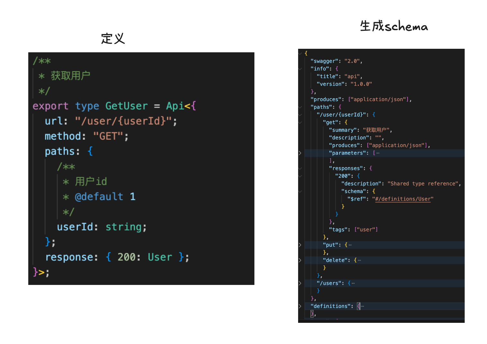
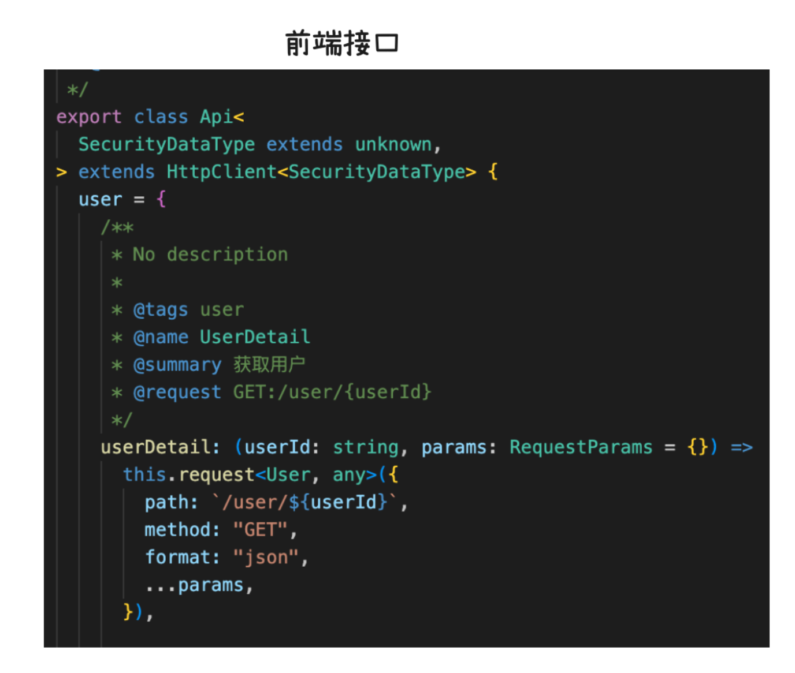
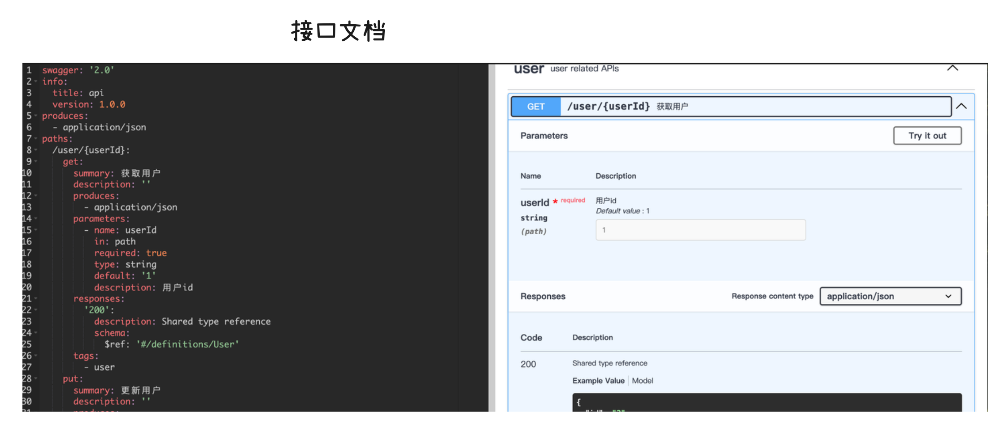

# define_api

> 接口定义是项目开发中非常重要的环节，可视化工具虽然方便，但可能会增加程序员的复杂度。

> 直接编写代码并生成文档后对照开发，更符合程序员的工作习惯。

> 本项目完全通过 GitHub Copilot 生成代码，目前仍处于早期开发阶段。

## Roadmap

- 使用 TypeScript 定义接口
  - 增加对 query 参数的支持
- 生成 OpenAPI Schema
  - 支持更多 TypeScript 泛型（目前支持 Omit）
  - 支持枚举类型
  - 支持数组等复杂类型
- 生成文档
  - 待完善
- 生成前端接口定义（通过 swagger-typescript-api 实现）
- 自动化测试接口返回数据
- 版本管理（通过 Git 或 Release 实现）

## 效果展示

1. 从接口定义生成 OpenAPI Schema
   
2. 生成前端代码
   
3. 生成文档
   

## 脚本

```shell
# 生成 schema
node cli.js

# 生成 typescript 代码npx swagger-typescript-api -p ./schema.json -o ./result
```

## 定义接口示例

```typescript
import { User } from "./common";
import { Api } from "./helper";

/**
 * 获取用户信息
 */
export type GetUser = Api<{
  url: "/user/{userId}";
  method: "GET";
  paths: {
    /**
     * 用户 ID
     */
    userId: string;
  };
  response: { 200: User };
}>;
```

## 生成 OpenAPI Schema 示例

```json
{
  "swagger": "2.0",
  "info": {
    "title": "API",
    "version": "1.0.0"
  },
  "produces": ["application/json"],
  "paths": {
    "/user/{userId}": {
      "get": {
        "summary": "获取用户信息",
        "description": "",
        "produces": ["application/json"],
        "parameters": [
          {
            "name": "userId",
            "in": "path",
            "required": true,
            "type": "string",
            "description": "用户 ID"
          },
          {
            "name": "name",
            "in": "path",
            "required": true,
            "type": "string",
            "description": "示例参数"
          }
        ],
        "responses": {
          "200": {
            "description": "共享类型引用",
            "schema": {
              "$ref": "#/definitions/User"
            }
          }
        }
      }
    }
  },
  "definitions": {
    "Sex": {
      "type": "string",
      "enum": ["man", "woman"],
      "description": "性别枚举"
    },
    "User": {
      "type": "object",
      "properties": {
        "id": {
          "type": "string"
        },
        "name": {
          "type": "string"
        },
        "sex": {
          "type": "string",
          "enum": ["man", "woman"]
        }
      },
      "description": "用户信息"
    },
    "UserWithoutId": {
      "type": "object",
      "properties": {
        "name": {
          "type": "string"
        },
        "sex": {
          "type": "string",
          "enum": ["man", "woman"]
        }
      },
      "description": "基于 User 类型的 Omit 示例（去除 ID）"
    }
  }
}
```
